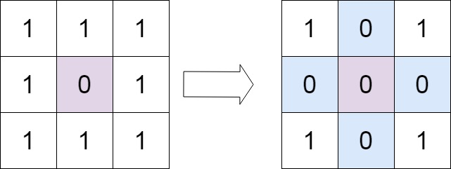
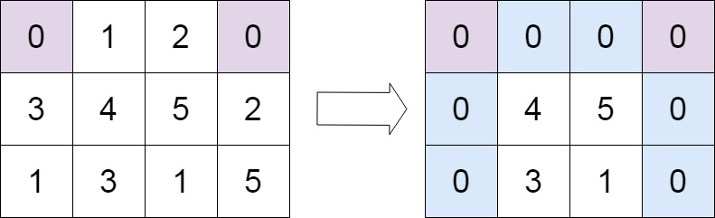

## Q1. Given an array nums containing n distinct numbers in the range [0, n], return the only number in the range that is missing from the array. 
*[leetcode - Missing Number(268)](https://leetcode.com/problems/missing-number/)*

```
Examples:

    Input: nums = [3,0,1]
    Output: 2
    Explanation: n = 3 since there are 3 numbers, so all numbers are in the range [0,3]. 2 is the missing number in the range since it does not appear in nums.

    Input: nums = [0,1]
    Output: 2
    Explanation: n = 2 since there are 2 numbers, so all numbers are in the range [0,2]. 2 is the missing number in the range since it does not appear in nums. 2 is the missing number in the range since it does not appear in nums.

    Input: nums = [9,6,4,2,3,5,7,0,1]
    Output: 8
    Explanation: n = 9 since there are 9 numbers, so all numbers are in the range [0,9]. 8 is the missing number in the range since it does not appear in nums.2 is the missing number in the range since it does not appear in nums.
```

### Approach 1: Brute Force
**Step 1:** Traverse through 1 to n as only numbers till N can be present in the array.

**Step 2:** Within the loop traverse the array to check if number exist or not.

```java
public class Solution {
    public int findMissingNumber(int[] nums) {
        for (int i = 1; i <= nums.length; i++) { // loop from 1 to n
            boolean flag = false;
            for (int num : nums) { // traverse all the numbers of the loop
                if (num == i) {
                    flag = true;
                    break;
                }
            }
            if (!flag) return i;
        }
        return -1;
    }
}
// Time Complexity: O(n^2)
// Space Complexity: O(1) - no additional data structures used.
```

### Approach 2: Better
**Step 1:** Create a hash array of length [n+1] to store the count of numbers 

**Step 2:** Traverse Hash Array to find the location with 0 count value.

```java
public class Solution {
    public int findMissingNumber(int[] nums) {
        int[] hashArray = new int[nums.length + 1];
        for (int num : nums) {
            hashArray[num]++;
        }
        for (int i = 1; i < hashArray.length; hashArray++) {
            if (hashArray[i] == 0) return i;
        }
        return -1;
    }
}
// Time Complexity: O(2n)
// Space Complexity: O(n) - hash array to store the count
```

### Approach 3: Optimal
**Step 1:** Sum all natural numbers till n.`sum = (n * (n + 1)) / 2`

**Step 2:** Sum all the elements in the array

**Step 3:** Subtract sum of elements from sum of natural numbers to get the result 

```java
public class Solution {
    public int findMissingNumber(int[] nums) {
        int n = nums.length;
        long sumOfNaturalNumbers = ((long) n * (n + 1)) / 2; // upcasting sum to long as multiplication of larger value of n can hit integer limit
        int sumOfElements = 0;
        for (int num : nums) { // loop from 1 to n
            sumOfElements += num;
        }
        return (int)(sumOfNaturalNumbers - sumOfElements);
    }
}
// Time Complexity: O(n)
// Space Complexity: O(1)
```

### Approach 4: Optimal
**Step 1:** XOR all the natural numbers till N.

**Step 2:** XOR all the array elements to the above XOR result

*Intuition: XOR of same number equals 0. By this logic all the natural numbers from `1-n` will cancel the numbers available in the array. Only one number will be left. That will be the missing number.*

```java
public class Solution {
    public int findMissingNumber(int[] nums) {
        int missingNumber = 0;
        for (int i = 0; i < nums.length; i++) {
            missingNumber = missingNumber ^ nums[i] ^ (i + 1);
        }
        return missingNumber;
    }
}
// Time Complexity: O(n)
// Space Complexity: O(1)
```
---
## Q2. Given an array, find the second-smallest and second-largest element in the array. Print ‘-1’ in the event that either of them doesn’t exist.
*TUF - [Second largest element in an Array](https://takeuforward.org/data-structure/find-second-smallest-and-second-largest-element-in-an-array/)*

```
Examples :

    Input: [1,2,4,7,7,5]
    Output: [2,5]
    Explanation: The elements are as follows 1,2,3,5,7,7 and hence second largest of these is 5 and second smallest is 2

    Input: [1]
    Output: [-1,-1]
    Explanation: Since there is only one element in the array, it is the largest and smallest element present in the array. There is no second largest or second smallest element present.
```

### Approach 1: Brute Force
**Step 1:** Sort the array

**Step 2:** Traverse from front and find the second smallest and break

**Step 3:** Traverse from rear and find the second largest and break

```java
public class Solution {
    public int findSeconds(int[] nums) {
        Arrays.sort(nums);
        int secondSmallest = secondSmallest(nums);
        int secondLargest = secondLargest(nums);
        return new int[]{secondSmallest, secondLargest};
    }

    private int secondLargest(int[] nums) {
        int largest = nums[nums.length - 1];
        for (int i = nums.length - 2; i >= 0; i--) {
            if (largest > nums[i]) return nums[i];
        }
        return -1;
    }

    private int secondSmallest(int[] nums) {
        int smallest = nums[0];
        for (int i = 0; i < nums.length; i++) {
            if (smallest < nums[i]) return nums[i];
        }
        return -1;
    }
}
// Time Complexity: O(n * log n) - due to sorting of array
// Space Complexity: O(1)
```

### Approach 2: Better
**Step 1:** Traverse to find the largest element

**Step 2:** Traverse to find the second-largest element

**Step 3:** Repeat above steps to find the second smallest

```java
public class Solution {
    public int findSeconds(int[] nums) {
        int secondSmallest = secondSmallest(nums);
        int secondLargest = secondLargest(nums);
        return new int[]{secondSmallest, secondLargest};
    }

    private int secondLargest(int[] nums) {
        int largest = Integer.MIN_VALUE;
        int secondLargest = Integer.MIN_VALUE;
        for (int num : nums) {
            largest = Math.max(largest, num);
        }
        for (int num : nums) {
            if (num < largest && num > secondLargest) 
                secondLargest = num;
        }
        return secondLargest != Integer.MIN_VALUE ? secondLargest : -1;
    }

    private int secondSmallest(int[] nums) {
        int smallest = Integer.MAX_VALUE;
        int secondSmallest = Integer.MAX_VALUE;
        for (int num : nums) {
            smallest = Math.min(smallest, num);
        }
        for (int num : nums) {
            if (num > smallest && num < secondSmallest) {
                secondSmallest = num;
            }
        }
        return secondSmallest != Integer.MAX_VALUE ? secondSmallest : -1;
    }
}
// Time Complexity: O(2n)
// Space Complexity: O(1)
```

### Approach 3: Optimal
**Step 1:** Assign largest and second-largest with MIN_VALUE and smallest and second-smallest with MAX_VALUE

**Step 2:** While traversing the loop, check current element is smallest then update `secondSmallest = smallest` and `smallest = nums[i]`

**Step 3:** Else if current element is smaller than just the second-smallest, update `secondSmallest = nums[i]`

**Step 4:** Perform Step 2 and Step 3 with modification to find second-largest

```java
public class Solution {
    public int findSeconds(int[] nums) {
        int secondSmallest = secondSmallest(nums);
        int secondLargest = secondLargest(nums);
        return new int[]{secondSmallest, secondLargest};
    }

    private int secondLargest(int[] nums) {
        int largest = Integer.MIN_VALUE;
        int secondLargest = Integer.MIN_VALUE;
        for (int num : nums) {
            if (num > largest) {
                secondLargest = largest;
                largest = num;
            } else if (num < largest && num > secondLargest) {
                secondLargest = num;
            }
        }
        return secondLargest != Integer.MIN_VALUE ? secondLargest : -1;
    }

    private int secondSmallest(int[] nums) {
        int smallest = Integer.MAX_VALUE;
        int secondSmallest = Integer.MAX_VALUE;
        for (int num : nums) {
            smallest = Math.min(smallest, num);
        }
        for (int num : nums) {
            if (num < smallest) {
                secondSmallest = smallest;
                smallest = num;
            } else if (num > smallest && num < secondSmallest) {
                secondSmallest = num;
            }
        }
        return secondSmallest != Integer.MAX_VALUE ? secondSmallest : -1;
    }
}
// Time Complexity: O(n)
// Space Complexity: O(1)
```
---

## Q3. Remove duplicates from sorted array
*leetcode - [Remove Duplicates from Sorted Array(26)](https://leetcode.com/problems/remove-duplicates-from-sorted-array/)*

```
Examples:

    Input: nums = [1,1,2]
    Output: 2, nums = [1,2,_]
    Explanation: Your function should return k = 2, with the first two elements of nums being 1 and 2 respectively.
        It does not matter what you leave beyond the returned k (hence they are underscores).

    Input: nums = [0,0,1,1,1,2,2,3,3,4]
    Output: 5, nums = [0,1,2,3,4,_,_,_,_,_]
    Explanation: Your function should return k = 5, with the first five elements of nums being 0, 1, 2, 3, and 4 respectively.
        It does not matter what you leave beyond the returned k (hence they are underscores).
```

### Approach 1: Brute Force
**Step 1:** Copy the elements into an ordered set (TreeSet in java)

**Step 2:** Copy back the data of set into the original array

**Step 3:** return the size of set as it indicates the number of distinct elements in the array

```java
public class Solution {
    public int removeDuplicates(int[] nums) {
        Set<Integer> uniqueElements = new TreeSet<>();
        
        for (int num : nums) {
            uniqueElements.add(num);
        }
        int index = 0;
        for(int element : uniqueElements) {
            nums[index++] = element;
        }
        return index;
    }
}
// Time complexity: O(n * log n) - Because of treeset
// Space complexity: O(k) - Because k distinct elements needs to be stored in treeset
```

### Approach 2: Optimal
**Step 1:** take two pointers, `i = 0` `j = 0`

**Step 2:** traverse the array using pointer `j`

**Step 3:** while traversing, if `nums[i] == nums[j]`, increment j

**Step 4:** else copy `nums[j]` into `nums[i+1]` 

*Intuition: Move second pointer until we find different number. Once we get a new number we increase the first pointer.* 

```java
public class Solution {
    public int removeDuplicates(int[] nums) {
        int i = 0, j = 0;
        while (j < nums.length) {
            if (nums[i] == nums[j]) {
                j++;
            } else {
                nums[i++] = nums[j];
            }
        }
        return i + 1;
    }
}
// Time Complexity: O(n)
// Space Complexity: O(1)
```
---

## Q4. Rotate array to the right by K steps.

*leetcode - [Rotate Array(189)](https://leetcode.com/problems/rotate-array/)*

```
Examples :

    Input: nums = [1,2,3,4,5,6,7], k = 3
    Output: [5,6,7,1,2,3,4]
    Explanation:
    rotate 1 steps to the right: [7,1,2,3,4,5,6]
    rotate 2 steps to the right: [6,7,1,2,3,4,5]
    rotate 3 steps to the right: [5,6,7,1,2,3,4]

    Input: nums = [-1,-100,3,99], k = 2
    Output: [3,99,-1,-100]
    Explanation: 
    rotate 1 steps to the right: [99,-1,-100,3]
    rotate 2 steps to the right: [3,99,-1,-100]
```

### Approach 1: Brute Force

**Step 1:** Loop `k` time and 

**Step 2:** Rotate array by 1 place at one iteration of outer loop

```java
public class Solution {
    public void rotateByKSteps(int[] nums, int k) {
        k %= nums.length;
        for (int i = 0; i < k; i++) {
            int temp = nums[nums.length - 1];
            for (int j = 1; j < nums.length; j++) {
                nums[j] = nums[j - 1];
            }
            nums[0] = temp;
        }
    }
}
// Time Complexity: O(k * n)
// Space Complexity: O(1)
```

### Approach 2: Better

**Step 1:** Copy last `k` elements into new array

**Step 2:** Move first `n-k` elements by `k` steps

**Step 3:** Copy the temp array data to `0-k` elements

```java
public class Solution {
    public void rotateByKSteps(int[] nums, int k) {
        int[] temp = new int[k];
        int idx = 0;
        for (int i = nums.length - k; i < nums.length; i++) {
            temp[idx++] = nums[i];
        }
        for (int i = nums.length - k - 1; i >= 0; i--) {
            nums[i + k] = nums[i];
        }

        for (int i = 0; i < k; i++) {
            nums[i] = temp[i];
        }
    }
}
// Time Complexity: O(n)
// Space Complexity: O(k)
```

### Approach 2: Better

**Step 1:** Copy last `k` elements into new array

**Step 2:** Move first `n-k` elements by `k` steps

**Step 3:** Copy the temp array data to `0-k` elements

```java
public class Solution {
    public void rotateByKSteps(int[] nums, int k) {
        k = k % nums.length;
        reverse(nums,0, nums.length - 1);
        reverse(nums, 0, k - 1);
        reverse(nums, k, nums.length - 1);
    }

    private  void reverse(int[] nums, int start, int end) {
        while (start < end) {
            int temp = nums[start];
            nums[start] = nums[end];
            nums[end] = temp;
            start++;
            end--;
        }
    }

}
// Time Complexity: O(n)
// Space Complexity: O(1)
```
---

### Q5. Move all `0's` to the end of it while maintaining the relative order of the non-zero elements.

*leetcode - [Move Zeroes](https://leetcode.com/problems/move-zeroes/)*

```
Example :

    Input: [0,1,0,3,12]
    Output: [1,3,12,0,0]
```

### Approach 1: Brute Force

**Step 1:** Store non-zero elements into temporary array.

**Step 2:** Copy non-zero elements into original array.

**Step 3:** Assign `0's` to the remaining portion of the array.

```java
public class Solution {
    public void moveZeros(int[] nums) {
        List<Integer> temp = new ArrayList<>();
        for (int num : nums) {
            if (num != 0)   temp.add(num);
        }
        for (int i = 0; i < temp.size(); i++) {
            nums[i] = temp.get(i);
        }
        for (int i = temp.size(); i < nums.length; i++) {
            nums[i] = 0;
        }
    }
}
// Time Complexity: O(2n)
// Space Complexity: O(n)
```

### Approach 2: Optimal

**Step 1:** Find the first `0` int the array and store it as `idx_0`.

**Step 2:** Traverse from `idx_0 + 1` and find non-zero. 

**Step 3:** If non-zero found swap with zero(`idx_0`)

```java
public class Solution {
    public void moveZeroes(int[] nums) {
        int i, idx_0 = 0;
        while (idx_0 < nums.length && nums[idx_0] != 0) {
            idx_0++;
        }
        i = idx_0 + 1;
        while (i < arr.length) {
            if (arr[i] != 0) {
                swap(arr, i, idx_0);
                idx_0++;
            }
            i++;
        }
    }
    private void swap(int[] arr, int i, int j) {
        int temp = arr[i];
        arr[i] = arr[j];
        arr[j] = temp;
    }
}
// Time Complexity: O(n)
// Space Complexity: O(1)
```
---

## Q6. Given a binary array, return the maximum number of consecutive `1's` in the array.

*leetcode - [Max Consecutive Ones](https://leetcode.com/problems/max-consecutive-ones/)

```
Example:

    Input: [1,1,0,1,1,1]
    Output: 3
    Explanation: The first two digits or the last three digits are consecutive 1s. The maximum number of consecutive 1s is 3.

```

## Approach

**Step 1:** While traversing the array, if the value at current index is equal to 1, increase count by 1.

**Step 2:** If value at current index is not equal to 1, compare count with maxCount, if count is more update maxCount.

**Step 3:** Perform comparison between count and maxCount for the final time after the execution of the loop, for a scenario where max consecutive is at the end.

```java
public class Solution {
    public int findMaxConsecutiveOnes(int[] nums) {
        int count = 0, maxCount = 0;
        for (int i = 0; i < nums.length; i++) {
            if (nums[i] == 1) {
                count++;
            } else {
                maxCount = Math.max(count, maxCount);
                count = 0;
            }
        }
        return Math.max(count, maxCount);
    }
}
// Time Complexity: O(n)
// Space Complexity: O(1)
```
---

## Q7. Given a non-empty array of integers, every element appears twice except for one. Find that single one.

*leetcode - [Single Number](https://leetcode.com/problems/single-number/)*

```
Examples:

    Input: nums = [2,2,1]
    Output: 1

    Input: nums = [4,1,2,1,2]
    Output: 4

    Input: nums = [1]
    Output: 1
```

### Approach 1 - Brute Force

**Step 1:** Iterate the array

**Step 2:** Linear search `nums[i]` element and count the occurrences.

**Step 3:** When occurrence of `nums[i] = 1` return from the function 

```java
public class Solution {
    public int singleNumber(int[] nums) {
        for (int num : nums) {
            int count = 0;
            for (int num1 : nums) {
                if (num1 == num) count++;
            }
            if (count == 1) return num;
        }
        return -1;
    }
}
// Time Complexity: O(n ^ 2)
// Space Complexity: O(1)
```

### Approach 2: Better

**Step 1:** Declare a hashmap

**Step 2:** Iterate over the array and store the number of occurrences in hashmap.

**Step 3:** Iterate the hash map, once a key is found with `count == 1` return the key.

```java
import java.util.HashMap;
import java.util.Map;

public class Solution {
    public int singleNumber(int[] nums) {
        Map<Integer, Integer> map = new HashMap<>();
        for (int num : nums) {
            int count = map.getOrDefault(num, 0);
            map.put(num, count + 1);
        }
        
        for (Map.Entry<Integer, Integer> entry: map.entrySet()) {
            if (entry.getValue() == 1) {
                return entry.getKey();
            }
        }
        return -1;
    }
}
// Time Complexity: O(n * log m) + O(m) - m = size of the map
// Space Complexity: O(m)
```

### Approach 3: Optimal

**Step 1:** Iterate the array

**Step 2:** XOR the values of the array into result.

*Intuition: As each element appears twice, XOR will cancel them, only the number that occurs once will be left.*

```java
class Solution {
    public int singleNumber(int[] nums) {
        int result = 0;
        for (int num : nums) {
            result ^= num;
        }
        return result;
    }
}
// Time Complexity: O(n)
// Space Complexity: O(1)
```
---

## Q8. Find the length of longest subarray that sums to K

*TUF - [Longest Subarray with given sum K](https://takeuforward.org/data-structure/longest-subarray-with-given-sum-k/)*

```
Examples:

    Input Format: N = 3, k = 5, array[] = {2,3,5}
    Result: 2
    Explanation: The longest subarray with sum 5 is {2, 3}. And its length is 2.
    
    Input Format: N = 3, k = 5, array[] = {2,3,5}
    Result: 2
    Explanation: The longest subarray with sum 5 is {2, 3}. And its length is 2.
```

### Approach 1:  Brute Force

**Step 1:** Iterate the array with the starting index

**Step 2:** For every iteration of starting index, make `sum = 0`

**Step 3:** Within the first loop, iterate the array from starting index and mark it as last_index of the subarray.

**Step 4:** Sum all the elements while iterating the inner loop

**Step 5:** When `sum == k`, find the subarray length using `last_index - start_index + 1`

**Step 6:** Compare the new length with the longest subarray length available

```java
public class Solution {
    public static int getLongestSubarray(int[] nums, long k) {
        int maxLen = 0;
        for (int startIdx = 0; startIdx < nums.length; startIdx++) { 
            long sum = 0; 
            for (int lastIdx = startIdx; lastIdx < nums.length; lastIdx++) { 
                // add the current element to the subarray a[i...j-1]:
                sum += nums[lastIdx];

                if (sum == k)
                    maxLen = Math.max(maxLen, lastIdx - startIdx + 1);
            }
        }
        return maxLen;
    }
}
// Time Complexity: O(n ^ 2)
// Space Complexity: O(1)
```

### Approach 2: Better

**Step 1:** Declare a hashmap to store the prefix sums and the indices

**Step 2:** Iterate over the array

**Step 3:** Store the sum into the hashmap as <sum, index>

**Step 4:** Check if the <current_sum - k> value is present in hashmap

**Step 5:** If present, then get the difference in their indices.

**Step 6:** If length is greater, then put it in result.

```java
public class Solution {
    public int getLongestSubarray(int[] nums, long k) {
        Map<Long, Integer> preSumMap = new HashMap<>();
        long sum = 0;
        int maxLen = 0;
        
        for (int i = 0; i < nums.length; i++) {
            sum += nums[i];
            if (sum == k) {
                maxLen = Math.max(maxLen, i + 1);
            }
            
            long rem = sum - k;
            if (preSumMap.containsKey(rem)) {
                int len = i - preSumMap.get(rem);
                maxLen = Math.max(maxLen, len);
            }
            
            if (!preSumMap.containsKey(sum)) {
                preSumMap.put(sum, i);
            }
        }
        return maxLen;
    }
}
// Time Complexity: O(n * log n)
// Space Complexity: O(n)
```

### Approach 3: Optimal

**Step 1:** Initially startIdx and lastIdx will be 0.

**Step 2:** Move the lastIdx if `sum <= k`, when `sum == k` check the length of subarray with current max

**Step 3:** Move startIdx if `sum > k`


```java
public class Solution {
    public int getLongestSubarray(int[] nums, long k) {
        int startIdx = 0, lastIdx = 0, maxLen = 0;
        long sum = nums[0];
        while(lastIdx < nums.length) {
            while(startIdx <= lastIdx && sum > k) {
                sum -= nums[startIdx];
                startIdx++;
            }
            if (sum == k) {
                maxLen = Math.max(maxLen, lastIdx - startIdx + 1);
            }
            lastIdx++;
            if (lastIdx < nums.length) {
                sum += nums[lastIdx];
            }
        }
        return maxLen;
    }
}
// Time Complexity: O(2n)
// Space Complexity: O(1)
```
---

## Q9. Given an array of integers nums and an integer target, return indices of the two numbers such that they add up to target. You may assume that each input would have exactly one solution, and you may not use the same element twice.

*leetcode - [Two Sum](https://leetcode.com/problems/two-sum/description/)*

```
Examples:

    Input: nums = [2,7,11,15], target = 9
    Output: [0,1]
    Explanation: Because nums[0] + nums[1] == 9, we return [0, 1]
    
    Input: nums = [3,2,4], target = 6
    Output: [1,2]
    
    Input: nums = [3,3], target = 6
    Output: [0,1]
```

### Approach 1: Brute Force

**Step 1:** Have nested loop, where i will be needed to traverse outer loop and j for inner loop.

**Step 2:** Loop i will be from `0 to n-1`.

**Step 3:** Loop j will be from `i+1 to n-1`.

**Step 4:** if `i + j == target`, return the 

```java
public class Solution {
    public int[] twoSum(int[] nums, int target) {
        for (int i = 0; i < nums.length; i++) {
            for (int j = i + 1; j < nums.length; j++) {
                if (nums[i] + nums[j] == target) {
                    return new int[]{i,j};
                }
            }
        }
        return new int[1];
    }
}
// Time Complexity: O(n^2)
// Space Complexity: O(1)
```

### Approach 2: Optimal (if index needed to return)

**Step 1:** Declare hashmap <number at i index, index in array>

**Step 2:** while iterating the array, check if `target - nums[i]` available in hashmap

**Step 3:** If yes, return the array index stored in map along with i

**Step 4:** If no, add the new combination `<nums[i], i>` into hashmap

```java
public class Solution {

    public int[] twoSum(int[] nums, int target) {
        Map<Integer, Integer> map = new HashMap<>();
        for (int i = 0; i < nums.length; i++) {
            int rem = target - nums[i];
            if (map.containsKey(rem)) {
                return new int[]{map.get(rem), i};
            } else {
                map.put(nums[i], i);
            }
        }
        return null;
    }
}
// Time complexity: O(n)
// Space complexity: O(n)
```

### Approach 3: Optimal (if true or false should be returned)

**Step 1:** Sort the array

**Step 2:** Use two pointers to traverse the array, `low = 0, high = nums.length - 1`

**Step 3:** If `nums[low] + nums[high] == target`, return true

**Step 4:** else if `nums[low] + nums[high] < target`, increment low by 

**Step 5:** else `nums[low] + nums[high] > target`, decrement high by 1

```java
public class Solution {

    public boolean twoSum(int[] nums, int target) {
        int low = 0, high = nums.length - 1;
        Arrays.sort(nums);
        while (low < high) {
            int sum = low + high;
            if (sum == target) {
                return true;
            } else if (sum < target) {
                low++;
            } else {
                high--;
            }
        }
        return false;
    }
}
// Time complexity: O(n * log n) + O(n)
// Space complexity: O(1)
```
---

## Q10. Given an array nums with n objects colored red, white, or blue, sort them in-place so that objects of the same color are adjacent, with the colors in the order red, white, and blue.

*leetcode - [Sort Colors](https://leetcode.com/problems/sort-colors/description/)*

```
Examples:

    Input: nums = [2,0,2,1,1,0]
    Output: [0,0,1,1,2,2]
    
     Input: nums = [2,0,1]
    Output: [0,1,2]
```

### Approach 1: Brute Force

**Step 1:** Count 0's, 1's and 2's.

**Step 2:** Loop for 0's count times and start replacing elements from 0th position.

**Step 3:** Loop for 1's count times from 0's count position + 1

**Step 4:** Loop for 2's count times from (0's count + 1's count) position + 1


```java
public class Solution {
    public void sortColors(int[] nums) {
        int count0s = 0, count1s = 0, count2s = 0;
        for (int num : nums) {
            switch (num) {
                case 0:
                    count0s++; break;
                case 1:
                    count1s++; break;
                case 2:
                    count2s++; break;
            }
        }
        for (int i = 0; i < nums.length; i++) {
            if (count0s > 0 ) {
                nums[i] = 0;
                count0s--;
            } else if (count1s > 0) {
                nums[i] = 1;
                count1s--;
            } else {
                nums[i] = 2;
            }
        }
    }
}
// Time Complexity: O(n) + O(n)
// Space Complexity: O(1)
```

### Approach 2: Optimal (Dutch National Flag Algorithm)

*Intuition: Assuming that all the elements should fall in this sequence to be sorted. `[0...(low-1)] -> 0`, `[low...(mid-1)] -> 1`, `[mid...high] -> 2`*

**Step 1**: Initialize `low = 0, mid = 0, high = nums.length - 1`

**Step 2**: Iterate the array till `mid <= high`

**Step 3:** If `nums[mid] == 0`, swap nums[low] and nums[mid] and increment both low and mid by 1

**step 4:** If `nums[mid] == 1`, just increment mid by 1

**Step 5:** If `nums[mid] == 2`, swap nums[mid] and nums[high] and decrement high by 1

```java
public class Solution {

    public void sortColors(int[] nums) {
        int low, mid, high;
        low = 0; high = nums.length; mid = 0;

        while(mid <= high) {
            switch(nums[mid]) {
                case 0:
                    swap(nums, low, mid);
                    low++; mid++;
                    break;
                case 1:
                    mid++;
                    break;
                case 2:
                    swap(nums, mid, high);
                    high--;
                    break;
            }

        }
    }

    private void swap(int[] nums, int i, int j) {
        int temp = nums[i];
        nums[i] = nums[j];
        nums[j] = temp;
    }
}
// Time Complexity: O(n)
// Space Complexity: O(1)
```
---

## Q11. Given an array nums of size n, return the majority element.

The majority element is the element that appears more than `⌊n / 2⌋` times. You may assume that the majority element always exists in the array.

*leetcode - [Majority Element](https://leetcode.com/problems/majority-element/)*
```
Examples: 
    Input: nums = [3,2,3]
    Output: 3
    
    Input: nums = [2,2,1,1,1,2,2]
    Output: 2
```

### Approach 1: Brute Force

Pick the element at index `i` and count the occurrences in the array. If occurrences is more than `⌊n / 2⌋` times return the element.

```java
// Time complexity: O(n ^ 2)
// Space Complexity: O(1)
```

### Approach 2: Better

**Step 1:** Use hashmap to store `<element, count>` pairs

**Step 2:** Traverse the array and update the count of the element. Simultaneously check if the count is greater than `⌊n / 2⌋`.

```java
import java.util.HashMap;

public class Solution {
    public int majorityElement(int[] nums) {
        Map<Integer, Integer> countMap = new HashMap<>();
        for (int num : nums) {
            int count = countMap.getOrDefault(num, 0);
            countMap.put(num, count + 1);
            
            if (count + 1 > nums.length / 2) {
                return num;
            }
        }
        return -1;
    }
}
// Time Complexity: O(n)
// Space Complexity: O(n/2)
```

### Approach 3: Optimal [Moore's Voting Algorithm]

*Intuition:*
*The question clearly states that the array has a majority element. Since it has a majority element we can say, the max count will definitely be more than `⌊n / 2⌋`.*
    
    Majority element count = n/2 + x
    Other elements = n/2 - x
    where x is the number of times it occurs after reaching n/2

*Now, we can say that count of majority elements are equal upto a certain point of time in array. So, when we traverse through the array we try to keep track of the count of elements and which element we are tracking. Since the majority element apprears more than n/2 times, we say that at some point in the array traversal we find the majority element.*

**Step 1:** Initialize two variables: `count: for tracking the count of element` and `candidate: store the candidate who has a positive count`

**Step 2:** While traversing the array, if `count == 0`, then change candidate to the current candidate

**Step 3:** if `candidate == current array element`, count increased by 1, else count decreased by  1.

```java
import java.util.HashMap;

public class Solution {
    public int majorityElement(int[] nums) {
        int count = 0; int candidate = nums[0];
        for (int num : nums) {
            count = candidate == num ? count + 1 : count - 1;
            if (count == 0) {
                candidate = num;
            }
        }
        return candidate;
    }
}
// Time Complexity: O(n)
// Space Complexity: O(1)
```
---

## Q12. Given an integer array nums, find the subarray with the largest sum, and return its sum.

*leetcode - [Maximum Subarray](https://leetcode.com/problems/maximum-subarray/description/)*

```
Examples:
    Input: nums = [-2,1,-3,4,-1,2,1,-5,4]
    Output: 6
    Explanation: The subarray [4,-1,2,1] has the largest sum 6.
    
    Input: nums = [5,4,-1,7,8]
    Output: 23
    Explanation: The subarray [5,4,-1,7,8] has the largest sum 23.
```

### Approach 1: Brute Force

Find the sum for all subarray and compare with the current max sum.

```java
public class Solution {
    public int maxSubArray(int[] nums) {
        int maxSum = Integer.MIN_VALUE;
        for (int i = 0; i < nums.length; i++) {
            int sum = nums[i];
            for (int j = i + 1; j < nums.length; j++) {
                sum+= nums[j];
                maxSum = Math.max(maxSum, sum);
            }
        }
        return maxSum;
    }
}
// Time Complexity: O(n^2)
// Space Complexity: O(1)
```

### Approach 2: Optimal [Kadane's Algorithm]

**Step 1:** Assign two variables: `maxSoFar` and `sum`

**Step 2:** Traverse the array and add `nums[i]` to sum

**Step 3:** if `sum < nums[i]`, then `sum = arr[i]`

**Step 4:** if `sum > maxSoFar`, then `maxSoFar = sum`

```java
public class Solution {
    public int maxSubArray(int[] nums) {
        int maxSoFar = Integer.MIN_VALUE;
        int sum = 0;
        
        for (int num : nums ) {
            sum += num;
            if (sum < num) {
                sum = num;
            }
            maxSoFar = Math.max(maxSoFar, sum);
        }
        return maxSoFar;
    }
}
// Time Complexity: O(n)
// Space Complexity: O(1)
```
---

## Q13. You are given a 0-indexed integer array nums of even length consisting of an equal number of positive and negative integers. You should return the array of nums such that the the array follows the given conditions:

**Every consecutive pair of integers have opposite signs**

**For all integers with the same sign, the order in which they were present in nums is preserved.**
 
**The rearranged array begins with a positive integer.**

*leetcode - [Rearrange Array Elements by Sign](https://leetcode.com/problems/rearrange-array-elements-by-sign/description/)*

```
Example:

    Input: nums = [3,1,-2,-5,2,-4]
    Output: [3,-2,1,-5,2,-4]
    Explanation:
    The positive integers in nums are [3,1,2]. The negative integers are [-2,-5,-4].
    The only possible way to rearrange them such that they satisfy all conditions is [3,-2,1,-5,2,-4].
    Other ways such as [1,-2,2,-5,3,-4], [3,1,2,-2,-5,-4], [-2,3,-5,1,-4,2] are incorrect because they do not satisfy one or more conditions.  
    
    Input: nums = [-1,1]
    Output: [1,-1]
    Explanation:
    1 is the only positive integer and -1 the only negative integer in nums.
    So nums is rearranged to [1,-1].

```

### Approach 1: Brute Force

**Step 1:** Create 2 new arrays of `originalLen / 2` length.

**Step 2:** While traversing the original array, add positives to positive array and negatives to negative array

**Step 3:** add back the numbers in original array, one from positive and one from negative at a time

```java
class Solution {
    public int[] rearrangeArray(int[] nums) {
        int originalLen = nums.length;
        int[] positives = new int[originalLen / 2];
        int[] negatives = new int[originalLen / 2];
        int posIndex = 0, negIndex = 0;
        
        for (int num : nums) {
            if (num < 0) {
                negatives[negIndex++] = num;
            } else {
                positives[posIndex++] = num;
            }
        }
        posIndex = 0; negIndex = 0;
        for (int i = 0; i < originalLen / 2; i++) {
            nums[2 * i] = positives[posIndex++];
            nums[(2 * i) + 1] = negatives[negIndex++];
        }
        return nums;
    }
}
// Time Complexity: O(n) + O(n/2)
// Space Complexity: O(n)
```

### Approach 2: Optimal

**Step 1:** Take two pointers `pos = 0` and `neg = 1`

**Step 2:** If nums[i] is positive, add nums[i] at result[pos] and then increase pos by 1

**Step 2:** If nums[i] is negative, add nums[i] at result[neg] and then increase neg by 1

```java
class Solution {
    public int[] rearrangeArray(int[] nums) {
        int[] res = new int[nums.length];
        int posIndex = 0, negIndex = 1;
        
        for (int num : nums) {
            if (num < 0) {
                res[negIndex] = num;
                negIndex += 2;
            } else {
                res[posIndex] = num;
                posIndex += 2;
            }
        }
        return res;
    }
} 
// Time Complexity: O(n)
// Space Complexity: O(n)
```
## Q14. Find next lexicographically greater permutation. If such arrangement is not possible, rearrange the array as the lowest possible order

*leetcode - [Next Permutation](https://leetcode.com/problems/next-permutation/description/)*

```
Examples:

    Input: [1, 2, 3]
    Output: [1, 3, 2]
    
    Input: [3, 2, 1]
    Output: [1, 2, 1]    

```

### Approach 1: Brute Force

**Step 1:** Find all possible permutations of elements present and store them.

**Step 2:** Search input from all possible permutations.

**Step 3:** Print the next permutation present right after it.

```
// Time Complexity: O(n! * n) - n! to find all possible permutation
// Space Complexity: O(1)
```

### Approach 2: Optimal

**Step 1:** Find the break point while traversing from right to left. Breakpoint - nums[i] < nums[i + 1]

**Step 2:** Find a number from right to i which is greater than nums[i] but smallest in the remaining array and swap.

**Step 3:** Reverse the array after ith index.

```java
class Solution {
    public void nextPermutation(int[] nums) {
        int breakIndex = -1;
        for (int i = nums.length - 2; i >= 0; i--) {
            if (nums[i] < nums[i + 1]) {
                breakIndex = i;
                break;
            }
        }
        if (breakIndex != -1 ){
            for (int i = nums.length - 1; i >= breakIndex; i--) {
                if (nums[i] > nums[breakIndex]) {
                    int temp = nums[i];
                    nums[i] = nums[breakIndex];
                    nums[breakIndex] = temp;
                    break;
                }
            }
        }
        int left = breakIndex + 1, right = nums.length - 1;
        while(left < right) {
            int temp = nums[left];
            nums[left] = nums[right];
            nums[right] = temp;
            left++;
            right--;
        }
    }
}
// Time Complexity: O(3n)
// Space Complexity: O(1)
```

## Q15. Print all the elements which are leaders. A leader is an element that is greater than all the elements on its right side in the array.

*TUF - [Leaders in an Array](https://takeuforward.org/data-structure/leaders-in-an-array/)*

```
Examples:
    Input: [4, 7, 1, 0]
    Output: 7 1 0
    Explanation: Rightmost element is always a leader. 7 and 1 are greater than the elements in their right side.
    
    Input: [10, 22, 12, 3, 0, 6]
    Output: 22 12 6
    Explanation: 6 is a leader. In addition to that, 12 is greater than all the elements in its right side (3, 0, 6), also 22 is greater than 12, 3, 0, 6.

```

### Approach 1: Brute Force

**Step 1:** Start checking the element from the start of the array.

**Step 2:** If the element at observation is greater than all the elements at right add it to the output array.

```
// Time Complexity: O(n^2)
// Space Complexity: O(n)
```

### Approach 2: Optimal

**Step 1:** Starting from the right side of the array, check if the current element is the greatest till now

**Step 2:** if current element is the greatest till now add it to the result

**Step 3:** reverse the result array

```java
public class Solution {
    public int[] leader(int[] nums) {
        int maxSoFar = Integer.MIN_VALUE;
        List<Integer> resList = new ArrayList<>();

        for (int i = nums.length - 1; i >= 0; i--) {
            if (nums[i] > maxSoFar) {
                maxSoFar = nums[i];
                resList.add(maxSoFar);
            }
        }
        Collections.reverse(resList);
        return resList.stream().toArray(int[]::new);
    }
}
// Time Complexity: O(2n)
// Space Complexity: O(n)
```

### Q16. Given an unsorted array of integers nums, return the length of the longest consecutive elements sequence.

*leetcode - [Longest Consecutive Sequence](https://leetcode.com/problems/longest-consecutive-sequence/description/)

```
Examples:
    
    Input: nums = [100,4,200,1,3,2]
    Output: 4
    Explanation: The longest consecutive elements sequence is [1, 2, 3, 4]. Therefore its length is 4.

    Input: nums = [0,3,7,2,5,8,4,6,0,1]
    Output: 9
```

### Approach 1: Brute force

**Step 1:** Sort the array

**Step 2:** Traverse the sorted array having two pointers - lastSmallest and current

**Step 3:** If lastSmallest == current, continue to next iteration

**Step 4:** If lastSmallest == current - 1, increment count and lastSmallest to current

**Step 5:** Else if lastSmallest != current - 1, get max of count and longestCount, set lastSmallest to current

```java
public class Solution {
    public int longestConsecutive(int[] nums) {
        Arrays.sort(nums);
        int longest = 1, count = 1, lastSmallest = nums[0];
        for (int currentIdx = 1; currentIdx < nums.length; currentIdx++) {
            if (lastSmallest == nums[currentIdx]) {
                continue;
            } else if(lastSmallest == nums[currentIdx] - 1) {
                count++;
                lastSmallest = nums[currentIdx];
            } else {
                longest = Math.max(longest, count);
                count = 1;
                lastSmallest = nums[currentIdx];
            }
        }
        return Math.max(longest, count);
    }
}
// Time Complexity: O(n * log n)
// Space Complexity: O(1)
```

### Approach 2: Optimal

**Step 1:** Put everything into set data structure.

**Step 2:** Traverse the array

**Step 3:** Check if set contains nums[currentIdx] - 1 value

**Step 4:** If yes, step the iteration

**Step 5:** If no, iterate over the set until set does not contain the next number

```java
public class Solution {
    public int longestConsecutive(int[] nums) {
        Set<Integer> set = new HashSet<>();
        int longest = 0;
        for (int num : nums) {
            set.add(num);
        }
        
        for (int num : nums) {
            if (set.contains(num - 1)) {
                continue;
            }
            int count = 0;
            int temp = num;
            while(set.contains(temp)) {
                count++;
                set.remove(temp);
                temp++;
            }
            longest = Math.max(longest, count);
        }
        return longest;
    }
}
// Time Complexity: O(2n)
// Space Complexity: O(n)
```

## Q17. Given an m x n integer matrix, if an element is 0, set its entire row and column to 0's.

*leetcode - [Set Matrix Zeroes](https://leetcode.com/problems/set-matrix-zeroes/description/)*

    Examples:

        Input: matrix = [[1,1,1],[1,0,1],[1,1,1]]
        Output: [[1,0,1],[0,0,0],[1,0,1]]
        
        Input: matrix = [[0,1,2,0],[3,4,5,2],[1,3,1,5]]
        Output: [[0,0,0,0],[0,4,5,0],[0,3,1,0]]





### Approach 1: Brute force

**Step 1:** While traversing the matrix identify zeroes.

**Step 2:** If current element is zero, mark all other non-zero elements in the row and column as -1

**Step 3:** Again iterate over the matrix, if element is -1 then make it 0


```java
public class Solution {
    public int[][] setZero(int[][] matrix) {

        for(int i = 0; i < matrix.length; i++) {
            for(int j = 0; j < matrix[i].length; j++) {
                if(matrix[i][j] == 0) {
                    for(int k = 0; k < matrix.length; k++) {
                        matrix[k][j] = matrix[k][j] == 0 ? 0 : -1;
                    }
                    for(int k = 0; k < matrix[i].length; k++) {
                        matrix[i][k] = matrix[i][k] == 0 ? 0 : -1;
                    }
                }
            }
        }

        for(int i = 0; i < matrix.length; i++) {
            for (int j = 0; j < matrix[i].length; j++){
                if(matrix[i][j] == -1)  matrix[i][j] = 0;
            }
        }

        return matrix;
    }
} 
// Time Complexity: O(n * m * (n + m)) 
// Space Complexity: O(1)
```

### Approach 2: Better

**Step 1:** Initialize 2 tracker arrays - ros and cols

**Step 2:** While iteration through the matrix, if 0 is found, mark rows[i] and cols[j] as 1, indicating they contain zero.

**Step 3:** Iterate over rows and if rows[i] is 1 then mark that row as zero in matrix

**Step 4:** Iterate over cols and if cols[i] is 1 then mark that col as zero in matrix

```java
public class Solution {
    public int[][] setZero_Approach2(int[][] matrix) {
        int[] rows = new int[matrix.length];
        int[] cols = new int[matrix[0].length];

        for(int i = 0; i < matrix.length; i++) {
            for(int j = 0; j < matrix[i].length; j++) {
                if(matrix[i][j] == 0) {
                    rows[i] = 1;
                    cols[j] = 1;
                }
            }
        }

        for(int i = 0; i < rows.length; i++) {
            if(rows[i] == 1) {
                for(int j = 0; j < matrix[0].length; j++) {
                    matrix[i][j] = 0;
                }
            }
        }
        for(int i = 0; i < cols.length; i++) {
            if(cols[i] == 1) {
                for(int j = 0; j < matrix.length; j++) {
                    matrix[j][i] = 0;
                }
            }
        }
        return matrix;
    }
}
// Time Complexity: O(n * m)
// Space Complexity: O(n + m)
```

### Approach 3: Optimal

*Intuition: In the previous approach, the time complexity is minimal as the traversal of a matrix takes at least O(NxM)(where N = row and M = column). instead of using two extra matrices row and col, we will use the 1st row and 1st column of the given matrix to keep a track of the cells that need to be marked with 0. But here comes a problem. If we try to use the 1st row and 1st column to serve the purpose, the cell matrix[0][0] is taken twice. To solve this problem we will take an extra variable col0 initialized with 1. Now the entire 1st row of the matrix will serve the purpose of the row array. And the 1st column from (0,1) to (0,m-1) with the col0 variable will serve the purpose of the col array.*

**Step 1:** Traverse the matrix and mark the proper cells of 1st row and column with 0 accordingly.  The marking will be like this: if cell(i, j) contains 0, mark the ith row, with 0 and mark jth column with 0. If i is 0 and mark `matrix[0][0]` with 0 but if j is 0, mark thc `col0` variable with 0 instead of marking `matrix[0][0]` again.

**Step 2:** Now modify the cells from (1,1) to (n-1, m-1) using the values from 1st row and 1st column and col0.

**Step 3:** Finally, change the 1st row and 1st column using the values from `matrix[0][0]` and col0. First change the row and then column

```java
public class Solution {
    public int[][] setZero_Approach3(int[][] matrix) {

        int col0 = 1;
        // step 1: Traverse the matrix and
        // mark 1st row & col accordingly:
        for (int i  = 0; i < matrix.length; i++) {
            for (int j = 0; j < matrix[i].length; j++) {
                if (matrix[i][j] == 0) {
                    matrix[i][0] = 0; // mark ith row

                    if (j != 0) {
                        matrix[0][j] = 0; // mark jth column
                    } else {
                        col0 = 0;
                    }
                }
            }
        }

        // step 2: mark with 0 from (1,1) to (n-1,m-1)
        for (int i = 1; i < matrix.length; i++) {
            for (int j = 1; j < matrix[i].length; j++) {
                if (matrix[i][j] != 0) {
                    // check for col and row
                    if (matrix[i][0] == 0 || matrix[0][j] == 0) {
                        matrix[i][j] = 0;
                    }
                }
            }
        }

        // step 3: finally mark the 1st col and then 1st row
        if (matrix[0][0] == 0) {
            for (int j = 0; j < matrix[0].length; j++) {
                matrix[0][j] = 0;
            }
        }
        if (col0 == 0) {
            for (int i = 0 ; i < matrix.length; i++) {
                matrix[i][0] = 0;
            }
        }

        return matrix;
    }
}
// Time Complexity: O(2*(n*m))
// Space Complexity: O(1)
```

## Q18. You are given an n x n 2D matrix representing an image, rotate the image by 90 degrees (clockwise).

* leetcode - [Rotate Image](https://leetcode.com/problems/rotate-image/description/)*


```
Examples:
    Input: matrix = [[1,2,3],
                     [4,5,6],
                     [7,8,9]]
    Output: [[7,4,1],
             [8,5,2],
             [9,6,3]]
             
    Input: matrix = [[5,1,9,11],
                     [2,4,8,10],
                     [13,3,6,7],
                     [15,14,12,16]]
    Output: [[15,13,2,5],
             [14,3,4,1],
             [12,6,8,9],
             [16,7,10,11]]

```

### Approach 1: Brute Force

**Step 1:** Fill the rotated values into a new matrix using formula: `result[j][n-1-i] = matrix[i][j]`

```java
public class Solution {
    public void rotate(int[][] matrix) {
        int[][] result = new int[matrix.length][matrix.length];
        
        for (int i = 0; i < matrix.length; i++) {
            for (int j = 0; j < matrix.length; j++) {
                result[j][matrix.length - 1 - i] = matrix[i][j];
            }
        }
        return result;
    }
}
// Time Complexity: O(n * n)
// Space Complexity: O(n * n)
```

### Approach 2: Optimal

**Step 1:** Transpose the matrix.

**Step 2:** Reverse each row of the matrix.

```java
public class Solution {
    public int[][] rotate(int[][] matrix) {
        for (int i = 0; i < matrix.length; i++) {
            for (int j = i; j < matrix.length; j++) {
                int temp = matrix[i][j];
                matrix[i][j] = matrix[j][i];
                matrix[j][i] = temp;
            }
        }

        for (int i = 0; i <  matrix.length; i++) {
            for (int j = 0; j < matrix.length / 2; j++) {
                int temp = matrix[i][j];
                matrix[i][j] = matrix[i][matrix.length - 1 -j];
                matrix[i][matrix.length - 1 - j] = temp;
            }
        }
        return matrix;
    }
}
// Time Complexity: O(2*(n * n)
// Space Complexity: O(1)
```


