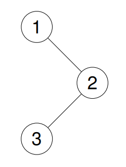
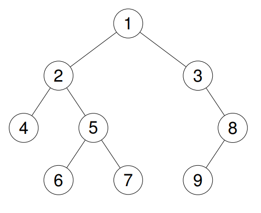
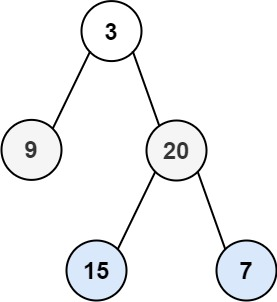

## Q1. Given the root of a binary tree, return the preorder traversal of its nodes' values.

*leetcode - [Binary Tree Preorder Traversal](https://leetcode.com/problems/binary-tree-preorder-traversal/description/)*

```
Examples:

Input: root = [1,null,2,3]
Output: [1,2,3]

Input: root = [1,2,3,4,5,null,8,null,null,6,7,9]
Output: [1,2,4,5,6,7,3,8,9]
```




### Approach 1: Recursive

**Step 1:** Print the current node data.

**Step 2:** Make a recursion call to left subtree

**Step 3:** Make a recursion call to right subtree.

```java
/**
 * Definition for a binary tree node.
 * public class TreeNode {
 *     int val;
 *     TreeNode left;
 *     TreeNode right;
 *     TreeNode() {}
 *     TreeNode(int val) { this.val = val; }
 *     TreeNode(int val, TreeNode left, TreeNode right) {
 *         this.val = val;
 *         this.left = left;
 *         this.right = right;
 *     }
 * }
 */
class Solution {
    public List<Integer> preorderTraversal(TreeNode root) {
        List<Integer> traversal = new ArrayList<>();
        helper(root, traversal);
        return traversal;
    }

    private void helper(TreeNode root, List<Integer> traversal) {
        if(root == null) {
            return;
        }
        traversal.add(root.val);
        helper(root.left, traversal);
        helper(root.right,traversal);
    }
}
// Time Complexity: O(n)
// Space Complexity: O(n), if recursion stack is considered
```

### Approach 2: Iterative

**Step 1:** Initialize a stack.

**Step 2:** Put the root node into the stack.

**Step 3:** Iterate over the stack until the stack is empty.

**Step 4:** Print the current top node of the stack.

**Step 4:** While iterating, first insert the right child node of current node taken from the stack. And then the left node.

```java
/**
 * Definition for a binary tree node.
 * public class TreeNode {
 *     int val;
 *     TreeNode left;
 *     TreeNode right;
 *     TreeNode() {}
 *     TreeNode(int val) { this.val = val; }
 *     TreeNode(int val, TreeNode left, TreeNode right) {
 *         this.val = val;
 *         this.left = left;
 *         this.right = right;
 *     }
 * }
 */
class Solution {
    public List<Integer> preorderTraversal(TreeNode root) {
        List<Integer> traversal = new ArrayList<>();
        if (root != null) {
            ArrayDeque<TreeNode> stack = new ArrayDeque<>();
            stack.push(root);
            
            while(!stack.isEmpty()) {
                TreeNode node = stack.pop();
                traversal.add(node.val);
                if(node.right != null ){
                    stack.push(node.right);
                }
                if(node.left != null) {
                    stack.push(node.left);
                }
            }
        }
        return traversal;
    }
}
// Time Complexity: O(n)
// Space Complexity: O(n)
```

## Q2. Given the root of a binary tree, return the inorder traversal of its nodes' values.

*leetcode - [Binary Tree Inorder Traversal](https://leetcode.com/problems/binary-tree-inorder-traversal/description/)*

```
Examples

Input: root = [1,null,2,3]
Output: [1,3,2]

Input: root = [1,2,3,4,5,null,8,null,null,6,7,9]
Output: [4,2,6,5,7,1,3,9,8]
```


### Approach 1: Recursive

**Step 1:** Recursively traverse the left node of the current node.

**Step 2:** Print the current node value.

**Step 3:** Recursively traverse the right node of the current node.

```java
/**
 * Definition for a binary tree node.
 * public class TreeNode {
 *     int val;
 *     TreeNode left;
 *     TreeNode right;
 *     TreeNode() {}
 *     TreeNode(int val) { this.val = val; }
 *     TreeNode(int val, TreeNode left, TreeNode right) {
 *         this.val = val;
 *         this.left = left;
 *         this.right = right;
 *     }
 * }
 */
class Solution {
    public List<Integer> inorderTraversal(TreeNode root) {
        List<Integer> result = new ArrayList<>();
        helper(root, result);
        return result;
    }
    
    private void helper(TreeNode node, List<Integer> result) {
        if (node == null){
            return;
        }
        helper(node.left, result);
        result.add(node.val);
        helper(node.right, result);
    }
}
```

### Approach 2: Iterative

**Step 1:** Initialize a stack

**Step 2:** Make root as the current node

**Step 3:** Enter infinite loop, this loop will keep going until the stack is empty

**Step 4:** Within loop, if node is not null, push the current node into stack and move to left.

**Step 5:** Once node value become null, check stack is empty or not. If empty break out of the loop. Else, process the top of the stack and move to right of the stack top node. 


```java
/**
 * Definition for a binary tree node.
 * public class TreeNode {
 *     int val;
 *     TreeNode left;
 *     TreeNode right;
 *     TreeNode() {}
 *     TreeNode(int val) { this.val = val; }
 *     TreeNode(int val, TreeNode left, TreeNode right) {
 *         this.val = val;
 *         this.left = left;
 *         this.right = right;
 *     }
 * }
 */
class Solution {
    public List<Integer> inorderTraversal(TreeNode root) {
        List<Integer> result = new ArrayList<>();
        ArrayDeque<TreeNode> st = new ArrayDeque<>();
        TreeNode node = root;
        while (true) {
            if (node != null) {
                st.push(node);
                node = node.left;
            } else {
                if (st.isEmpty()) {
                    break;
                } 
                node = st.pop();
                result.add(node.val);
                node = node.right;
            }
        }
        return result;
    }
}
```

## Q3. Given the root of a binary tree, return the postorder traversal of its nodes' values.

*leetcode - [Binary Tree Postorder Traversal](https://leetcode.com/problems/binary-tree-postorder-traversal/description/)

```
Examples:

Input: root = [1,null,2,3]
Output: [3,2,1]

Input: root = [1,2,3,4,5,null,8,null,null,6,7,9]
Output: [4,6,7,5,2,9,8,3,1]
```


### Approach 1: Recursive

**Step 1:** Recursively traverse the left node of the current node.

**Step 2:** Recursively traverse the right node of the current node.

**Step 3:** Print the current node value.

```java
/**
 * Definition for a binary tree node.
 * public class TreeNode {
 *     int val;
 *     TreeNode left;
 *     TreeNode right;
 *     TreeNode() {}
 *     TreeNode(int val) { this.val = val; }
 *     TreeNode(int val, TreeNode left, TreeNode right) {
 *         this.val = val;
 *         this.left = left;
 *         this.right = right;
 *     }
 * }
 */
class Solution {
    public List<Integer> postorderTraversal(TreeNode root) {
        List<Integer> result = new ArrayList<>();
        helper(root, result);
        return result;
    }
    
    private void helper(TreeNode node, List<Integer> result) {
        if (node == null){
            return;
        }
        helper(node.left, result);
        helper(node.right, result);
        result.add(node.val);
    }
}
```

### Approach 2: Iterative - 2 Stacks

**Step 1:** Initialize two stacks - stack_1, stack_2

**Step 2:** Put the root into stack_1 

**Step 3:** Iterate over stack_1 until its empty

**Step 4:** While iterating the stack, take out the stack_1 top and put back the left and right child into stack_1. Then put the element popped from stack_1 into stack_2.

**Step 5:** Iterate over stack_2 until its empty. While iterating print the values

```java
/**
 * Definition for a binary tree node.
 * public class TreeNode {
 *     int val;
 *     TreeNode left;
 *     TreeNode right;
 *     TreeNode() {}
 *     TreeNode(int val) { this.val = val; }
 *     TreeNode(int val, TreeNode left, TreeNode right) {
 *         this.val = val;
 *         this.left = left;
 *         this.right = right;
 *     }
 * }
 */
class Solution {
    public List<Integer> postorderTraversal(TreeNode root) {
        List<Integer> result = new ArrayList<>();
        ArrayDeque<TreeNode> stack1 = new ArrayDeque<>();
        ArrayDeque<TreeNode> stack2 = new ArrayDeque<>();
        
        if(root != null) {
            stack1.push(root);
            while(!stack1.isEmpty()) {
                TreeNode node = stack1.pop();
                stack2.push(node);
                if(node.left != null) {
                    stack1.push(node.left);
                }
                if(node.right != null) {
                    stack1.push(node.right);
                }
            }
            
            while (!stack2.isEmpty()) {
                result.add(stack2.pop().val);
            }
            return result;
        }
    }
}
```

### Approach 3: Iterative - 1 Stack

**Step 1:** Initialize a stack and a variable `lastVisited` to null

**Step 2:** Iterate until the is empty or current node is not null

**Step 3:** While iterating, if current node is not null, push it to the stack and move to left child

**Step 4:** If current node is  null, look at the top node of the stack, but don't pop it yet

**Step 5:** If top node has a right child and lastVisisted is not the right child, move to the right child

**Step 6:** Else pop the top from the stack and add to result and set lastVisisted to the popped node

```java
public class Solution {
    public List<Integer> postorderTraversal(TreeNode root) {
        List<Integer> result = new ArrayList<>();
        Deque<TreeNode> stack = new ArrayDeque<>();
        // 'current' is the node we are currently exploring
        TreeNode current = root;
        // 'lastVisited' tracks the last node we visited (to handle right subtree processing)
        TreeNode lastVisited = null;

        // Traverse the tree until both stack is empty and current is null
        while (!stack.isEmpty() || current != null) {

            // Step 1: Go as left as possible
            if (current != null) {
                stack.push(current);       // Push current node to stack
                current = current.left;    // Move to its left child
            } else {
                // Step 2: Look at the node on top of the stack (don't pop yet)
                TreeNode peekNode = stack.peek();
                // If right child exists and it hasn’t been visited yet
                if (peekNode.right != null && lastVisited != peekNode.right) {
                    current = peekNode.right; // Move to the right child
                } else {
                    // Step 3: Process current node (both children have been visited)
                    stack.pop();                     // Pop from stack
                    result.add(peekNode.val);        // Add node value to result
                    lastVisited = peekNode;          // Mark this node as visited
                }
            }
        }
        return result;
    }

}
```

## Q4. Given the root of a binary tree, return the level order traversal of its nodes' values. (i.e., from left to right, level by level).

*leetcode - [Binary Tree Level Order Traversal](https://leetcode.com/problems/binary-tree-level-order-traversal/)*

```
Examples

Input: root = [3,9,20,null,null,15,7]
Output: [[3],[9,20],[15,7]]
```



### Approach 1: Iterative

**Step 1:** Create an empty queue and put the root node into the queue if root is not null.

**Step 2:** While the queue is not empty, get the number of node currently in the queue as this level will have those many nodes.

**Step 3:** Iterate over the queue for current size of the queue to process the current level

**Step 4:** While processing the current node add the children to the queue and node to the result.

```java
/**
 * Definition for a binary tree node.
 * public class TreeNode {
 *     int val;
 *     TreeNode left;
 *     TreeNode right;
 *     TreeNode() {}
 *     TreeNode(int val) { this.val = val; }
 *     TreeNode(int val, TreeNode left, TreeNode right) {
 *         this.val = val;
 *         this.left = left;
 *         this.right = right;
 *     }
 * }
 */
class Solution {
    public List<List<Integer>> levelOrder(TreeNode root) {
        List<List<Integer>> res = new ArrayList<>();
        Queue<TreeNode> queue = new LinkedList<>();

        if(root != null) {
            queue.add(root);
            while(!queue.isEmpty()) {
                List<Integer> level = new ArrayList<>();
                int queueSize = queue.size();
                while(queueSize > 0) {
                    TreeNode node = queue.remove();
                    level.add(node.val);
                    if(node.left != null) {
                        queue.add(node.left);
                    }
                    if(node.right != null) {
                        queue.add(node.right);
                    }
                    queueSize--;
                }
                res.add(level);
            }
        }

        return res;
        

    }
}
```

### Approach 2: Recursive

**Step 1:** Traverse the tree recursively while maintaining the level data

**Step 2:** While traversing the tree, if node becomes null return

**Step 3:** In every recursive call check if the result size is less than the level, if yes then we need to create a sublist within the main list of that level

**Step 4:** Add the node value to sublist and call the recursion for left child then the right child

```java
/**
 * Definition for a binary tree node.
 * public class TreeNode {
 *     int val;
 *     TreeNode left;
 *     TreeNode right;
 *     TreeNode() {}
 *     TreeNode(int val) { this.val = val; }
 *     TreeNode(int val, TreeNode left, TreeNode right) {
 *         this.val = val;
 *         this.left = left;
 *         this.right = right;
 *     }
 * }
 */
class Solution {
    public List<List<Integer>> levelOrder(TreeNode root) {
        List<List<Integer>> res = new ArrayList<>();
        traverse(root, res, 0);
        return res;
    }

    private void traverse(TreeNode node, List<List<Integer>> result, int level) {
        if(node == null) {
            return;
        }
        if(result.size() <= level) {
            result.add(new ArrayList<>());
        }
        result.get(level).add(node.val);
        traverse(node.left, result, level+1);
        traverse(node.right, result, level+1);
    }
}
```

## Q5. Given the root of a binary tree, return its maximum depth.

*leetcode - [Maximum Depth of Binary Tree](https://leetcode.com/problems/maximum-depth-of-binary-tree/description/)*

*A binary tree's maximum depth is the number of nodes along the longest path from the root node down to the farthest leaf node.*

```
Examples:

Input: root = [1,2,3,4,5,null,8,null,null,6,7,9]
Output: 4
```


### Approach 1: Iterative (Level Order traversal)

**Step 1:** Initiate a queue.

**Step 2:** Traverse the tree each level at a time.

**Step 3:** When traversing each level increment the depth counter by 1.

```java
/**
 * Definition for a binary tree node.
 * public class TreeNode {
 *     int val;
 *     TreeNode left;
 *     TreeNode right;
 *     TreeNode() {}
 *     TreeNode(int val) { this.val = val; }
 *     TreeNode(int val, TreeNode left, TreeNode right) {
 *         this.val = val;
 *         this.left = left;
 *         this.right = right;
 *     }
 * }
 */
class Solution {
    public int maxDepth(TreeNode root) {
        if(root == null) {
            return 0;
        }
        Queue<TreeNode> queue = new LinkedList<>();
        int depthCounter = 0;
        queue.add(root);
        while(!queue.isEmpty()) {
            depthCounter++;
            int size = queue.size();
            for(int i = 0; i < size; i++) {
                TreeNode node = queue.remove();
                if(node.left != null) {
                    queue.add(node.left);
                }
                if(node.right != null) {
                    queue.add(node.right);
                }
            }
        }
        return depthCounter;
    }
}
// Time Complexity: O(n)
// Space Complexity: O(n)
```

### Approach 2: Recursive

**Step 1:** Set the base condition of recursion - when node is null return 0.

**Step 2:** While back tracking, take the retuned value from left subtree and compare with right subtree. Whichever is greater add 1 to it and return.

```java
/**
 * Definition for a binary tree node.
 * public class TreeNode {
 *     int val;
 *     TreeNode left;
 *     TreeNode right;
 *     TreeNode() {}
 *     TreeNode(int val) { this.val = val; }
 *     TreeNode(int val, TreeNode left, TreeNode right) {
 *         this.val = val;
 *         this.left = left;
 *         this.right = right;
 *     }
 * }
 */
class Solution {
    public int maxDepth(TreeNode root) {
        if(root == null) {
            return 0;
        }
        int left = maxDepth(root.left);
        int right = maxDepth(root.right);
        return Math.max(left, right) + 1;
    }
}
// Time Complexity: O(n)
// Space Complexity: O(h), h -> height of the tree. h can be equal to n if tree is skewed
```

## Q6. Given a binary tree, determine if it is height-balanced.

*leetcode - [Balanced Binary Tree](https://leetcode.com/problems/balanced-binary-tree/description/)*

*A height-balanced binary tree is a binary tree in which the depth of the two subtrees of every node never differs by more than one.*

```
Examples:

Input: root = [1,2,3,4,5,null,8,null,null,6,7,9]
Output: false

Input: root = [3,9,20,null,null,15,7]
Output: true

```


### Approach 1

**Step 1:** Define a helper function that returns a object `Pair(isBalanced, height)`

**Step 2:** Define base condition - `node == null` then return `Pair(isBalanced: true, height: 0)`

**Step 3:** Recursively check left and right subtrees and get pair objects from both

**Step 4:** If either of the pair object contains `isBalanced: false` then the subtree is not balanced. No need to compare the current level. Simply return `Pair(isBalanced: false, height: does not matter)`

**Step 5:** Else if both subtrees are balanced, check the difference between height of both subtrees is more than 1 or not. If yes, return  `Pair(isBalanced: false, height: does not matter)`

**Step 6:** If the difference is <= 1 then return  `Pair(isBalanced: true, height: Math.max(leftHeight, rightHeight) + 1)`

```java
/**
 * Definition for a binary tree node.
 * public class TreeNode {
 *     int val;
 *     TreeNode left;
 *     TreeNode right;
 *     TreeNode() {}
 *     TreeNode(int val) { this.val = val; }
 *     TreeNode(int val, TreeNode left, TreeNode right) {
 *         this.val = val;
 *         this.left = left;
 *         this.right = right;
 *     }
 * }
 */
class Solution {
    public boolean isBalanced(TreeNode root) {
        Pair p = helper(root);
        return p.isBalanced;
    }
    private Pair helper(TreeNode root){
        if(root == null){
            return new Pair(true,0);
        }
        Pair left = helper(root.left);
        Pair right = helper(root.right);
        if(!left.isBalanced || !right.isBalanced){
            return new Pair(false,0);
        }
        if(Math.abs(left.height-right.height) <= 1){
            return new Pair(true,1 + Math.max(left.height,right.height));
        }
        return new Pair(false,0);
    }
}

class Pair{
    boolean isBalanced;
    int height;
    
    public Pair(boolean isBalanced, int height){
        this.height = height;
        this.isBalanced = isBalanced;
    }
}
```

### Approach 2:

*This approach is similar to the first approach. But instead of creating new Pair objects each time, we are passing the height directly in the helper method recursion*

**Step 1:** Set the base condition in helper method - `node == null` then return 0.

**Step 2:** Get the height of left subtree.

**Step 3:** If the height of left  subtree is -1, i.e., left subtree is not balanced. Do not check for right subtree. Simply mark right subtree as -1.

**Step 4:** If left or right have -1 return -1.

**Step 5:** Else if difference between left and right is more than 1. return -1.

**Step 6:** Else return the max height of left and right + 1.

```java
/**
 * Definition for a binary tree node.
 * public class TreeNode {
 *     int val;
 *     TreeNode left;
 *     TreeNode right;
 *     TreeNode() {}
 *     TreeNode(int val) { this.val = val; }
 *     TreeNode(int val, TreeNode left, TreeNode right) {
 *         this.val = val;
 *         this.left = left;
 *         this.right = right;
 *     }
 * }
 */
class Solution {
    public boolean isBalanced(TreeNode root) {
        if(root == null) {
            return true;
        }
        int left = helper(root.left);
        int right = helper(root.right);

        return compare(left, right)  != -1 ? true : false; 
    }

    private int helper(TreeNode node) {
        if(node == null) {
            return 0;
        }

        int left = helper(node.left);
        int right = left != -1 ? helper(node.right) : -1;

        return compare(left, right);
    }

    private int compare(int left, int right) {
        if(left == -1 || right == -1){
            return -1;
        } else if(Math.abs(left - right) > 1) {
            return -1;
        } else {
            return Math.max(left, right) + 1;
        }
    }
}
```

## Q7. Given the roots of two binary trees `p` and `q`, check if they are the same or not.

*leetcode - [Same Tree](https://leetcode.com/problems/same-tree/description/)*

*Two binary trees are considered the same if they are structurally identical, and the nodes have the same value.*

```
Examples:

Input: p = [1,2,3], q = [1,2,3]
Output: true

Input: p = [1,2], q = [1,null,2]
Output: false

Input: p = [1,2,1], q = [1,1,2]
Output: false
```

### Approach 1:

**Step 1:** Set base condition - `p == null && q == null` then return true.

**Step 2:** Check if `p.val == q.val` then check left subtree and right subtree. Else return false.

**Step 3:** Compare the return values of left and right subtree and return true if both are true.

```java
/**
 * Definition for a binary tree node.
 * public class TreeNode {
 *     int val;
 *     TreeNode left;
 *     TreeNode right;
 *     TreeNode() {}
 *     TreeNode(int val) { this.val = val; }
 *     TreeNode(int val, TreeNode left, TreeNode right) {
 *         this.val = val;
 *         this.left = left;
 *         this.right = right;
 *     }
 * }
 */
class Solution {
    public boolean isSameTree(TreeNode p, TreeNode q) {
        if(p == null && q == null) {
            return true;
        } else if (p == null || q == null) {
            return false;
        }

        if(p.val != q.val) {
            return false;
        }

        return isSameTree(p.left, q.left) && isSameTree(p.right, q.right);
    }
}
```